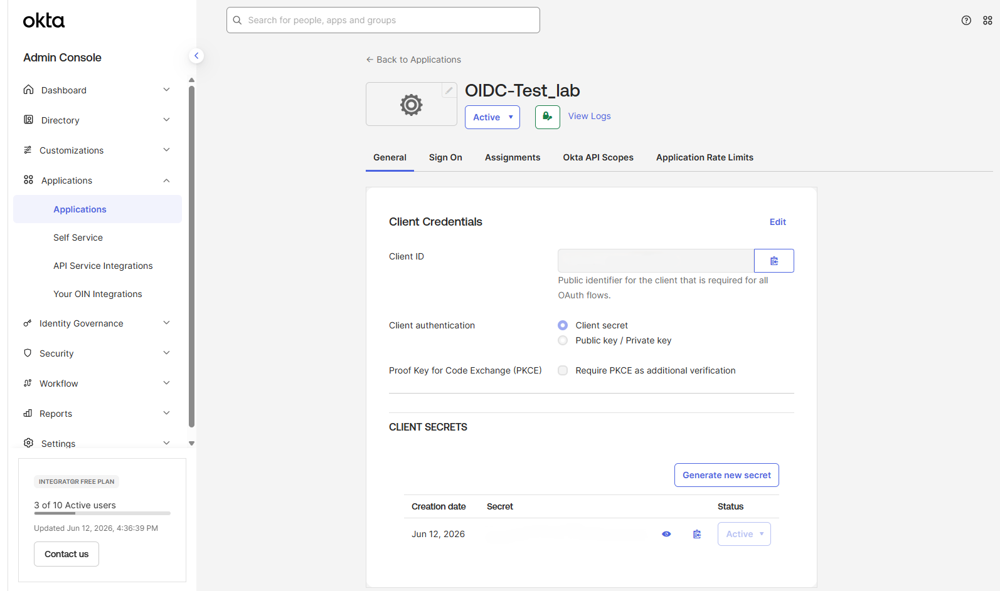
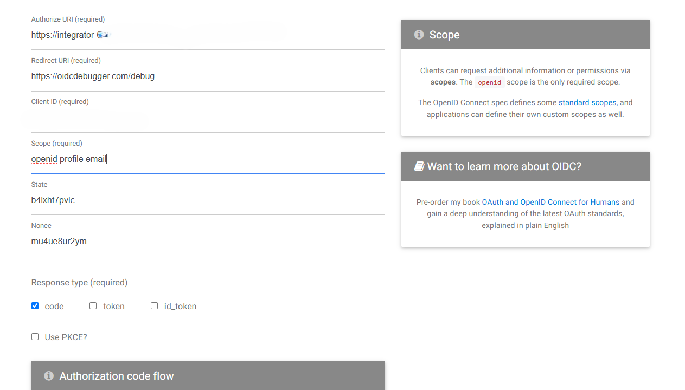
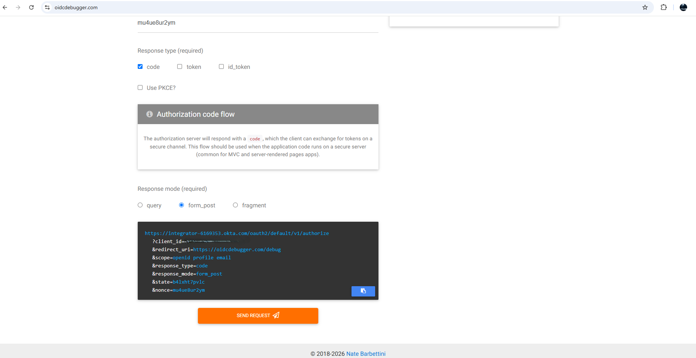
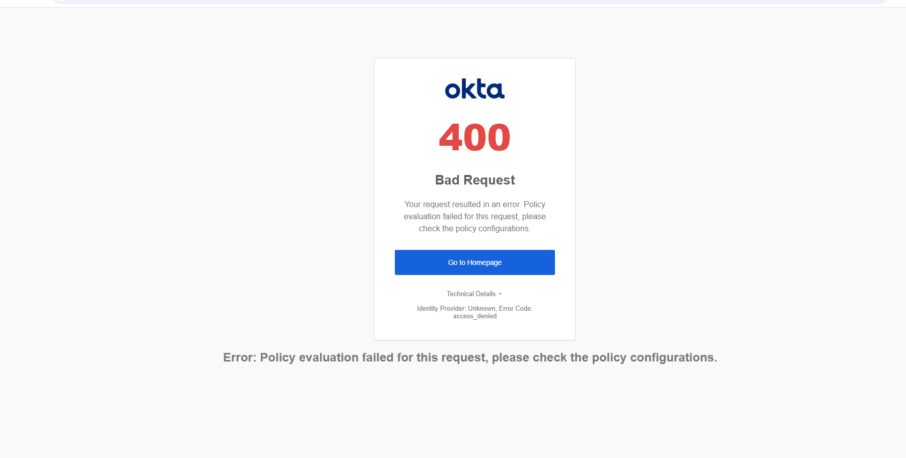
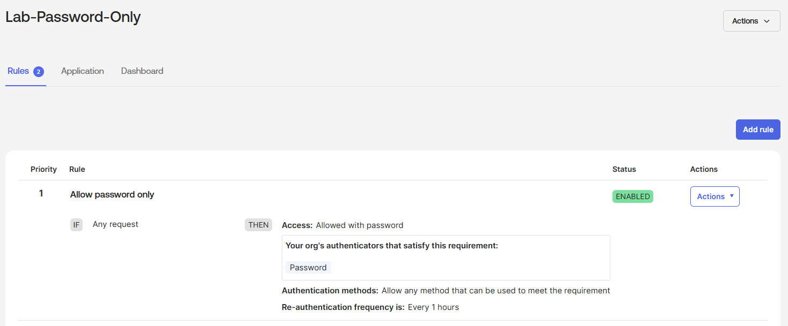
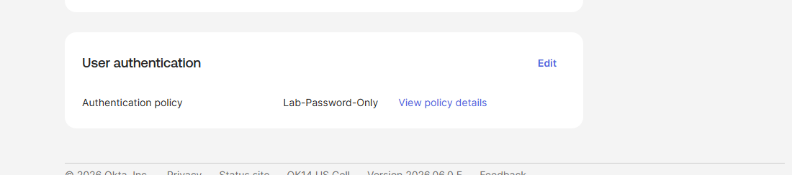
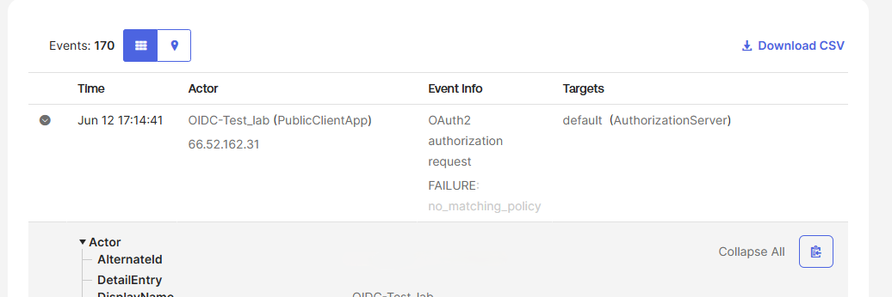
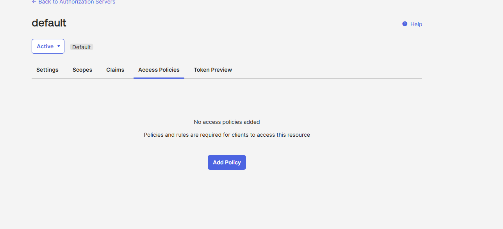
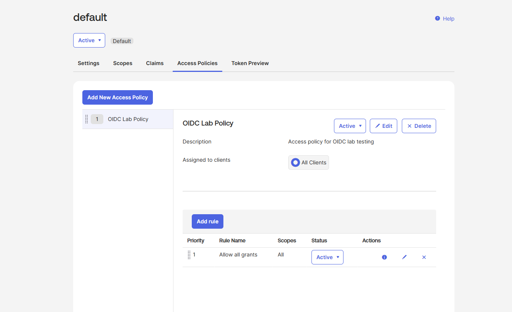
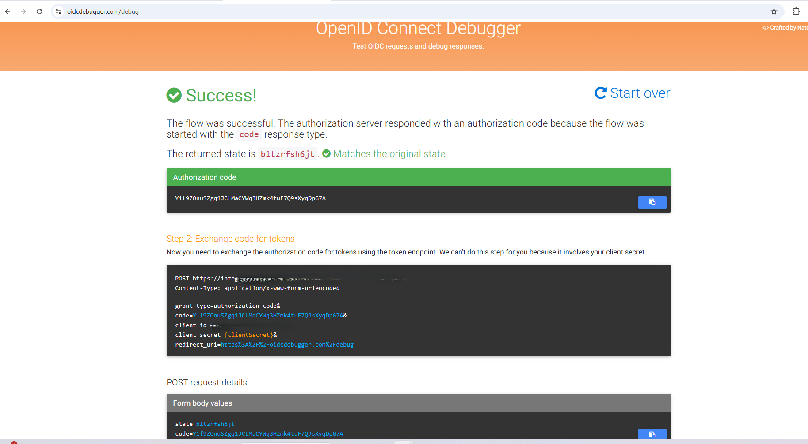

# OIDC Flow and Troubleshooting

**Environment:** Okta Integrator Tenant / OIDC Web App Integration

**Tool used:** OIDC Debugger (oidcdebugger.com)

**Goal:** Complete a real OIDC authorization code flow using Okta
as the Identity Provider and document every error encountered
along the way.

---

## What is the OIDC Authorization Code Flow?

OIDC (OpenID Connect) is a modern identity protocol built on top
of OAuth 2.0. Unlike SAML which uses XML assertions, OIDC uses
JSON Web Tokens (JWTs) and standard web protocols.

The authorization code flow works in five steps:

1. User attempts to access an app
2. App redirects user to the Identity Provider (Okta) with an
   authorization request
3. User authenticates with Okta
4. Okta returns a short-lived authorization code to the app
5. App exchanges the code for an ID token and access token
   using its Client Secret (server-side only)

The authorization code never travels through the browser after
Step 4 — the token exchange happens server-to-server. This is
what makes the flow secure.

---

## App Configuration

**App type:** Web Application (OIDC)
**Grant type:** Authorization Code
**Sign-in redirect URI:** https://oidcdebugger.com/debug
**Scopes requested:** openid profile email

---

## OIDC Debugger Request

The authorization request sent to Okta contained the following
parameters:

- `client_id` — identifies the app to Okta
- `redirect_uri` — where Okta sends the authorization code
- `scope` — what user information is being requested
- `response_type=code` — tells Okta to use authorization code flow
- `response_mode=form_post` — how the response is delivered
- `state` — random value to prevent CSRF attacks
- `nonce` — random value to prevent token replay attacks

---

## Troubleshooting: Three Errors Encountered and Resolved

Getting a working OIDC flow required diagnosing and fixing three
separate configuration issues. Each one revealed an important
concept about how Okta evaluates OIDC requests.

---

### Error 1: 400 Bad Request — Policy evaluation failed

**Symptom:** Okta returned a 400 error immediately without
showing a login screen.

**Root cause:** The app was assigned the `Any two factors`
authentication policy, which requires MFA. OIDC Debugger is
an external testing tool that cannot complete an MFA challenge,
so Okta denied the request before authentication could begin.

**Fix:** Created a new authentication policy called
`Lab-Password-Only` with a single rule allowing access with
password only.

**What this taught me:** Authentication policies and app
assignment are separate concerns in Okta. An app can be
active and correctly configured but still fail if the
authentication policy assigned to it doesn't match the
capabilities of the client making the request.

---

### Error 2: no_matching_policy — Authorization server rejection

**Symptom:** Still receiving a 400 error after fixing the
authentication policy. Checked the Okta System Log and found
the exact failure reason.

**Root cause:** The Okta System Log revealed `FAILURE:
no_matching_policy` — meaning the default authorization server
had no access policies configured at all. This is a completely
separate policy layer from the authentication policy.

In Okta, OIDC token requests go through two separate policy
evaluations:
1. **Authentication policy** — controls how the user authenticates
2. **Authorization server access policy** — controls whether the
   app is allowed to request tokens at all

The default authorization server had no access policies, so
every token request was rejected regardless of authentication.

**Fix:** Created an access policy called `OIDC Lab Policy` on
the default authorization server with a rule allowing
authorization code grants for all users and all scopes.
Assigned the policy to All Clients.

**What this taught me:** This was the most important lesson
of the entire lab. Authentication policies and authorization
server access policies are two completely separate layers in
Okta's OIDC architecture. Both must be correctly configured
for a token request to succeed. Confusing these two layers
is one of the most common mistakes when setting up OIDC
integrations — even for experienced engineers.

---

### Error 3: Client assignment field not saving

**Symptom:** When trying to assign `OIDC-Test-lab` specifically
to the access policy, the client name kept disappearing from
the field after typing.

**Root cause:** The Integrator Free Plan has limitations on
per-client policy assignment through the UI.

**Fix:** Changed the policy assignment from a specific client
to **All Clients**, which applied the policy across the entire
authorization server. This is acceptable for a lab environment
though in production you would scope access policies to
specific clients for tighter security control.

**What this taught me:** Understanding the difference between
lab configurations and production configurations matters.
In a real enterprise environment, access policies should be
scoped to specific clients rather than all clients to enforce
least privilege.

---

## Successful OIDC Flow

After resolving all three errors the authorization code flow
completed successfully.

**What the success screen confirmed:**
- Okta issued a valid authorization code
- The state parameter matched the original value — confirming
  no tampering occurred during the redirect
- The token exchange endpoint was correctly constructed with
  grant_type, code, client_id, client_secret placeholder,
  and redirect_uri

**Why the flow stops at the authorization code:** OIDC Debugger
intentionally cannot complete Step 5 (code for token exchange)
because that step requires the Client Secret, which must only
exist server-side. This is a security feature, not a limitation
— the secret should never be exposed to a browser.

---

## Key Concepts Demonstrated

**Authorization code flow security:** The short-lived code
prevents token interception. Even if someone intercepted the
redirect, the code expires in seconds and requires the Client
Secret to exchange.

**State parameter:** Prevents CSRF attacks by ensuring the
response matches the original request. Okta validated this
automatically — visible in the "Matches the original state"
confirmation.

**Nonce parameter:** Prevents token replay attacks by embedding
a unique value in the ID token that the app can verify.

**Two-layer policy architecture:** Okta evaluates OIDC requests
against both authentication policies and authorization server
access policies. Both layers must permit the request for the
flow to succeed.

**System Log as a diagnostic tool:** The Okta System Log
provided the exact failure reason (`no_matching_policy`) that
made it possible to identify the correct fix. Generic error
messages alone would not have been sufficient.

---

## Related files in this lab
- [OIDC Authentication Flow diagram](OIDC-Authentication-Flow-diagram.png)
  — *coming soon*
- [oidc-app-integration-walkthrough.md](oidc-app-integration-walkthrough.md)
  — *coming soon*
