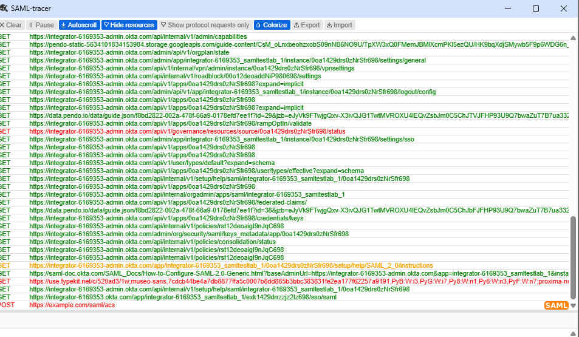
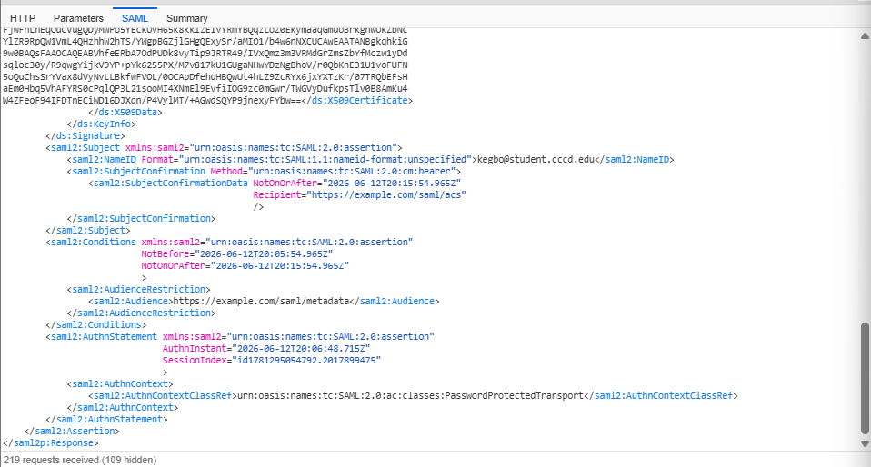
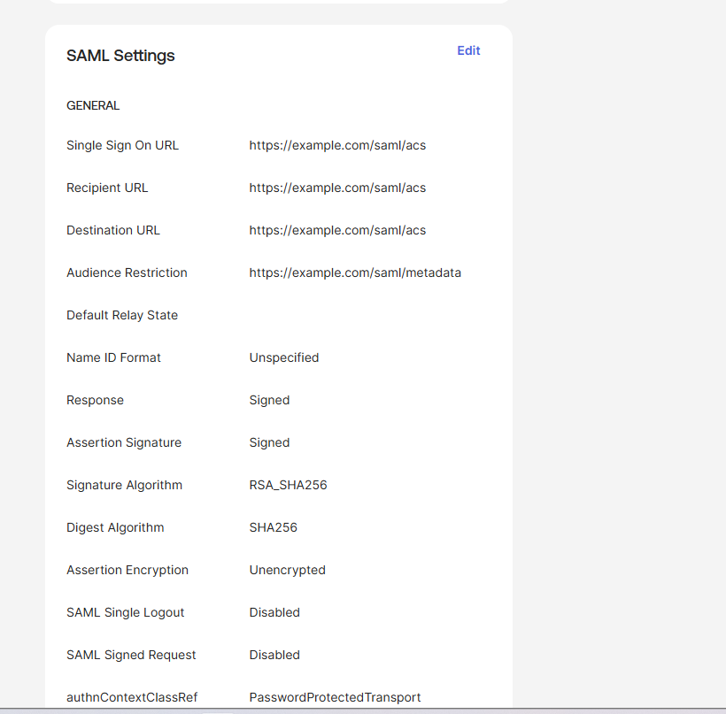
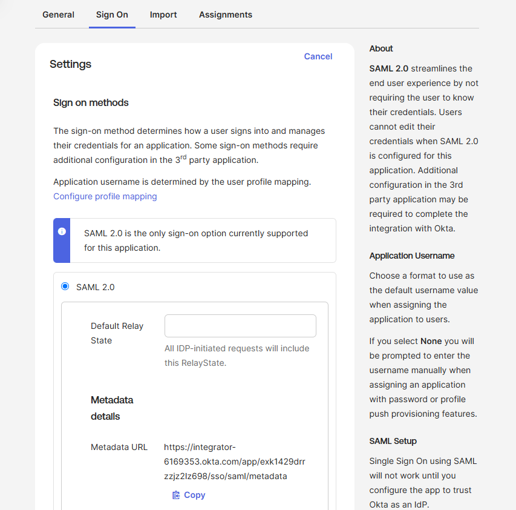
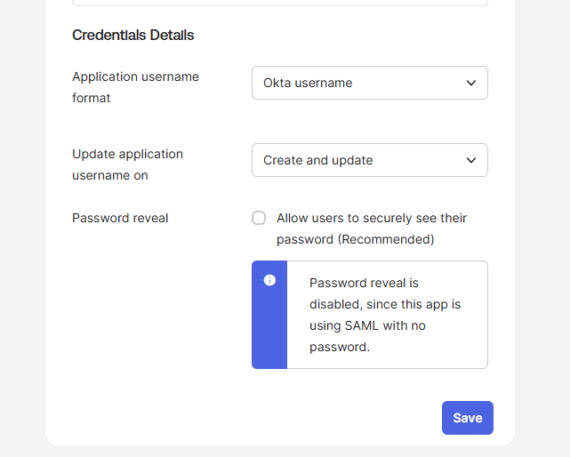

# SAML Troubleshooting Scenarios

---

## Scenario 1: NameID Format Mismatch

**Environment:** Okta Integrator Tenant / Custom SAML App
**Tool used to diagnose:** SAML Tracer (Chrome extension)
**Symptom:** SAML assertion delivered successfully by Okta but
rejected by the Service Provider due to incorrect NameID format

---

### What I observed
Using SAML Tracer, I captured the live SAML assertion being sent
from Okta to the Service Provider. The assertion was technically
delivered — Okta was functioning correctly — but the NameID format
declaration in the XML was set to `unspecified` instead of
`emailAddress`. A Service Provider configured to expect email
format would reject this assertion and deny the user access.

Below is the SAML Tracer window capturing the live traffic at the
moment the assertion was sent:

---

### Before and after comparison

**Before (misconfigured assertion):**
- NameID Format: `urn:oasis:names:tc:SAML:1.1:nameid-format:unspecified`
- Application username: Okta username

Here is the raw XML assertion captured before the fix, showing
the incorrect format declaration:

Here are the Okta settings that produced this misconfigured assertion:

---

**After (corrected assertion):**
- NameID Format: `urn:oasis:names:tc:SAML:1.1:nameid-format:emailAddress`
- Application username: Email

Here are the corrected Okta settings:

Here is the raw XML assertion captured after the fix, confirming
the correct format declaration:

---

### Root cause
The SAML app was configured with Name ID Format set to
`Unspecified` and Application username set to `Okta username`.
While Okta sent the correct email value in the assertion, the
format declaration told the SP to expect a different identifier
type. Enterprise SPs with strict format validation reject
assertions where the format declaration does not match their
expected configuration.

---

### How I diagnosed it
1. Installed SAML Tracer Chrome extension
2. Triggered a login attempt via the Okta SSO URL
3. Captured the POST request to the ACS URL in SAML Tracer
4. Clicked the SAML tab to decode the raw XML assertion
5. Located the `<saml2:NameID>` element and identified the
   incorrect format declaration

---

### How I fixed it
1. Navigated to Okta Admin → Applications → SAML-Test-lab →
   General tab → SAML Settings → Edit
2. Changed **Name ID format** from `Unspecified` to `EmailAddress`
3. Changed **Application username** from `Okta username` to `Email`
4. Clicked Next → Finish to save
5. Re-triggered the login and captured the new assertion in
   SAML Tracer to verify the fix

---

### What this taught me
Reading raw SAML XML directly is more reliable than relying on
error messages alone. The error a user sees ("access denied" or
a generic 400 error) gives no indication of whether the problem
is the format declaration, the value itself, the certificate, or
the ACS URL. SAML Tracer removes the guesswork entirely by
showing exactly what the IdP sent and what the SP received.

A second key insight: the assertion being delivered does not mean
the integration is working. Delivery and acceptance are two
separate events in SAML — a common source of confusion when
troubleshooting SSO failures.

---

### Additional observations
The assertion also revealed a 10-minute validity window:

- `NotBefore` — the assertion is not valid before this timestamp
- `NotOnOrAfter` — the assertion expires after this timestamp

Clock skew between IdP and SP is another common SAML failure
cause. If the SP clock is more than a few minutes out of sync
with the IdP, valid assertions get rejected as expired. This is
worth checking when a SAML integration works intermittently
rather than failing consistently.
