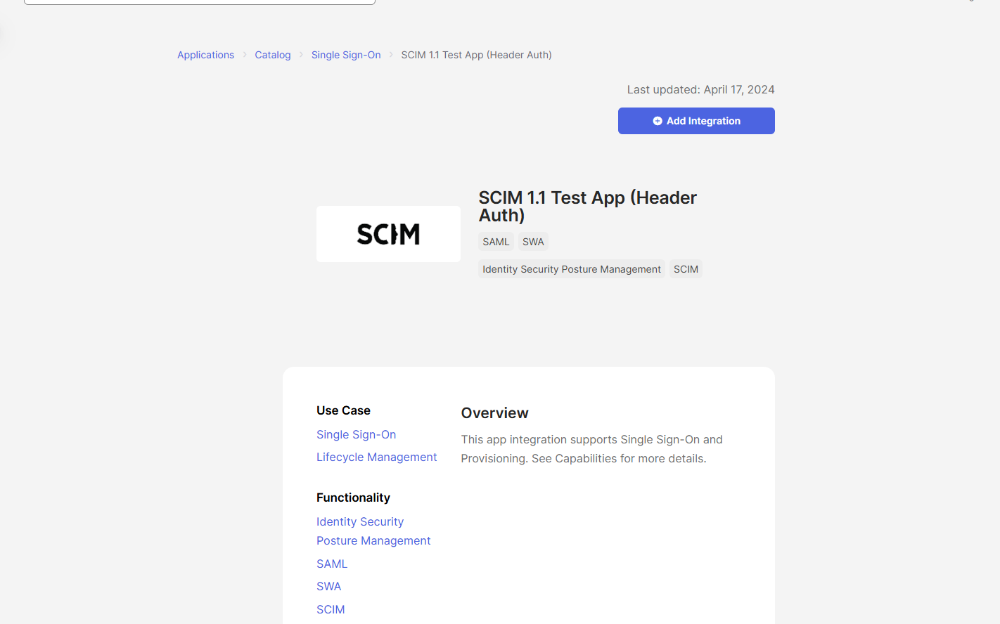
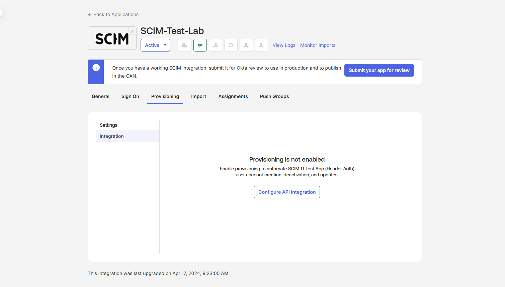
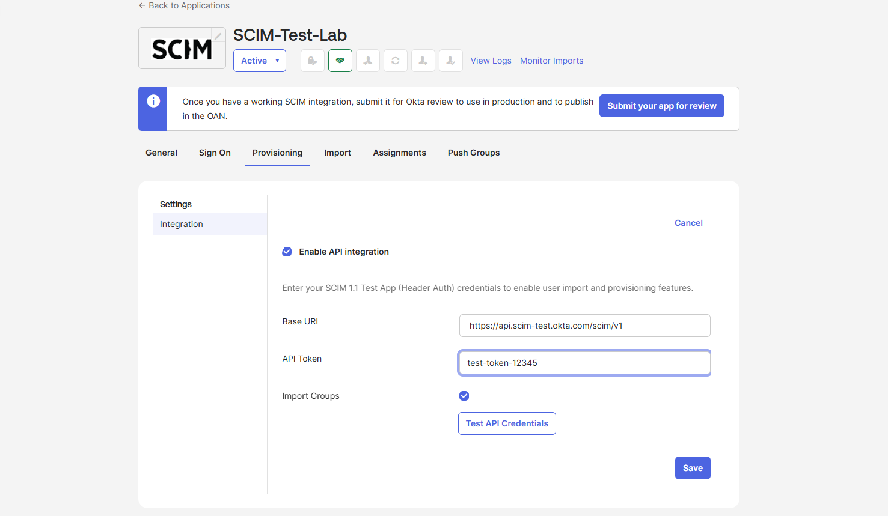
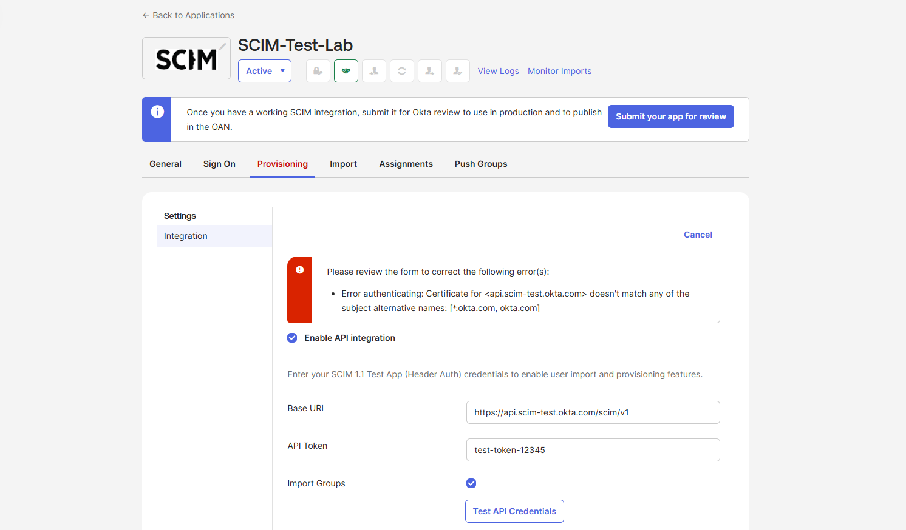
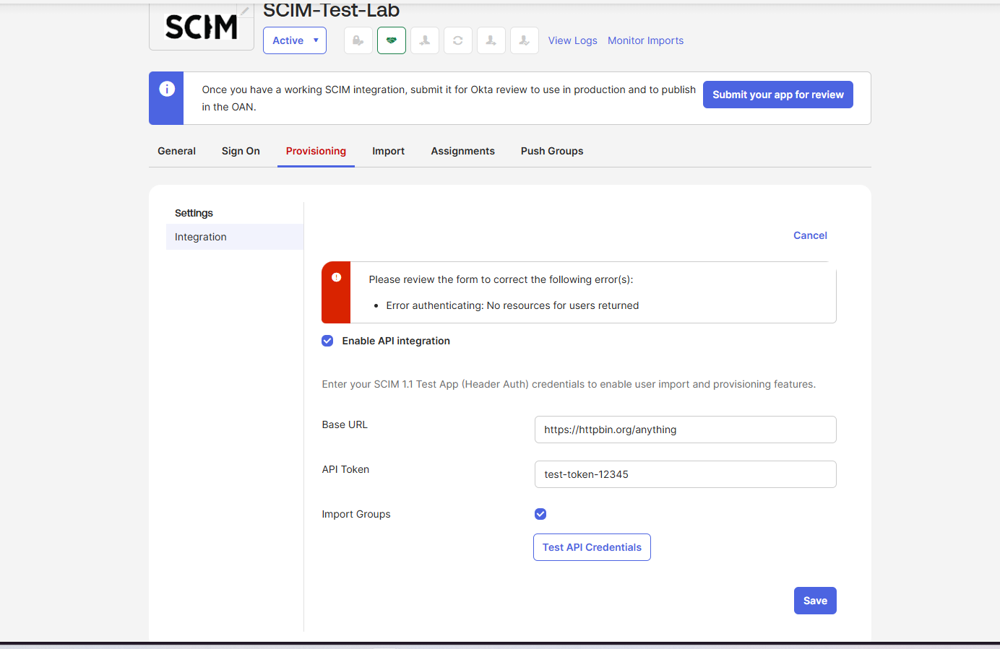

# SCIM Provisioning Setup and Troubleshooting

**Environment:** Okta Integrator Tenant / SCIM 1.1 Test App (Header Auth)

**Goal:** Configure SCIM provisioning in Okta and document the
connection validation process, including real errors encountered
when pointing Okta at non-SCIM-compliant endpoints.

---

## What is SCIM?

SCIM (System for Cross-domain Identity Management) automates user
provisioning between systems. While SAML and OIDC handle
**authentication** — proving who a user is at login — SCIM handles
**provisioning** — automatically creating, updating, and
deactivating user accounts across connected applications.

In a real enterprise environment, SCIM is what allows a single
action in an HR system (like marking an employee as terminated)
to automatically deactivate that person's accounts across every
connected application without manual intervention.

---

## App Selection

Okta provides a built-in SCIM 1.1 Test App (Header Auth) designed
specifically for practicing SCIM configuration without requiring
a paid, real-world SCIM-compliant target system.

---

## Initial State

After adding the app integration, provisioning is not enabled by
default and must be configured manually under the Provisioning tab.

---

## Configuring the SCIM Connection

SCIM provisioning requires two key pieces of information:

- **Base URL** — the SCIM API endpoint Okta will call to manage users
- **API Token** — the authentication credential for that endpoint

---

## Troubleshooting: Two Connection Errors Encountered

### Error 1: SSL Certificate Mismatch

**What happened:** When testing the API credentials against a
placeholder Base URL, Okta returned a certificate validation error.

**Root cause:** The domain used in the Base URL did not have a
valid SSL certificate matching its hostname. Okta validates SSL
certificates before attempting any SCIM API calls, as a security
measure to prevent provisioning data from being sent to an
unverified endpoint.

**What this taught me:** SCIM endpoints must have valid, properly
configured SSL certificates. This is a common point of failure
when standing up new SCIM integrations — the connection can fail
before any SCIM-specific logic is even evaluated, simply because
of certificate configuration.

---

### Error 2: SCIM Schema Non-Compliance

**What happened:** After pointing to a real, certificate-valid
HTTPS endpoint (httpbin.org, a public testing service), the
certificate error was resolved, but a new error appeared.

**Root cause:** While the connection succeeded at the network and
SSL level, the target endpoint was not an actual SCIM server. It
did not return data in the SCIM-formatted JSON schema that Okta
expects from a `/Users` endpoint (specifically, a `Resources` array
following the SCIM 1.1 or 2.0 specification). Okta correctly
detected the response did not conform to SCIM standards and
rejected the connection.

**What this taught me:** A successful network connection is not
the same as a successful SCIM integration. The target system must
implement the actual SCIM protocol specification — correct
endpoints (`/Users`, `/Groups`), correct response schema, and
correct attribute naming — not just respond to HTTPS requests.
This distinction between "reachable" and "SCIM-compliant" is a
key troubleshooting concept for real provisioning integrations.

---

## Key Concepts Demonstrated

**Two-layer connection validation:** SCIM connections are validated
at two levels — first the transport layer (valid HTTPS, valid SSL
certificate), then the application layer (valid SCIM schema and
endpoints). A failure at either layer prevents the integration
from working, but the error messages and root causes are
completely different.

**SCIM vs generic REST APIs:** Not every HTTPS endpoint is
SCIM-compliant. SCIM requires specific endpoint paths, response
schemas, and attribute structures defined by the SCIM
specification (RFC 7643 and RFC 7644 for SCIM 2.0).

**Provisioning vs authentication:** This lab reinforced the
distinction between what SAML/OIDC handle (authentication) and
what SCIM handles (lifecycle provisioning) — two related but
separate concerns in identity architecture.

---

## What I'd do differently

In a future iteration of this lab, I would deploy a minimal
SCIM-compliant mock server (using a free hosting service and a
small script implementing the SCIM `/Users` schema) to complete
a full successful provisioning test, including user creation
and deactivation events visible in the Okta System Log.

---

## Related files in this lab
- README.md — folder overview
